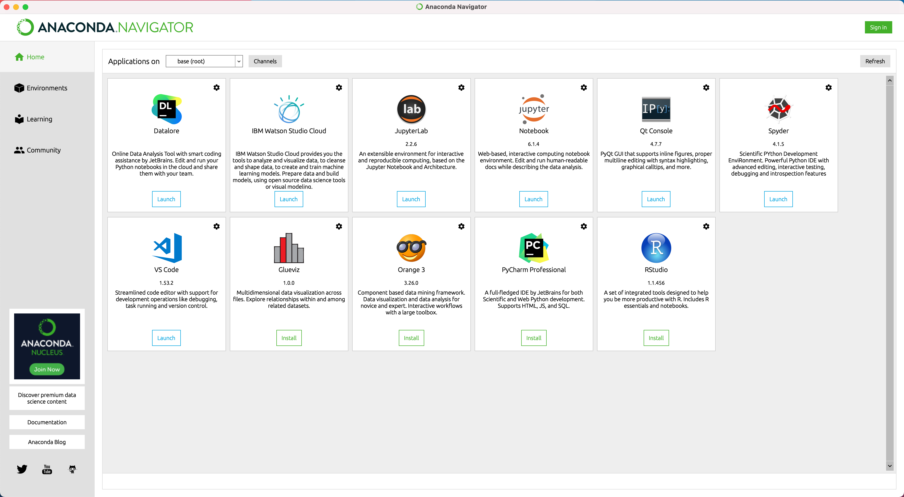
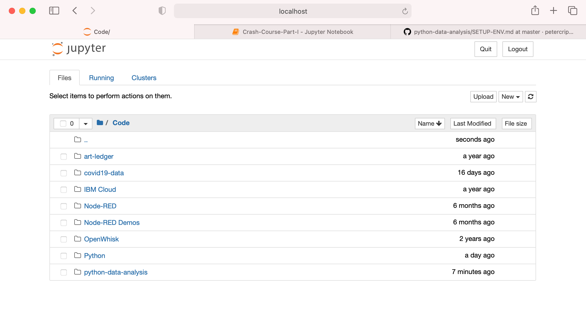

# Setting Up a Python Environment
To learn Python we're going to use a browser based tool called the *Jupyter Notebook*. Jupyter allows you to type Python code and see the output all in the same place. It also has lots of in-built functions to make it easier for you to learn and use Python.

We'll be downloading Jupyter, as well as a number of other useful data science tools and libraries from a [Anaconda](https://www.anaconda.com). To download Anaconda for your operating system visit https://www.anaconda.com/products/individual and choose your operating system. Once the download has completed open the dowloaded file and follow the instructions to install it.  

Once you have installed Anaconda you need to run the Anaconda Navigator from wherever it was installed. You should see a screen like this.

From here you can launch the Jupyter Notebook by clicking on the `Launch` button for that application. The Jupyter Notebook will open in a new browser window.

You're now ready to start the first part of this module, [Python Crash Course - Part I](PART-I.md).