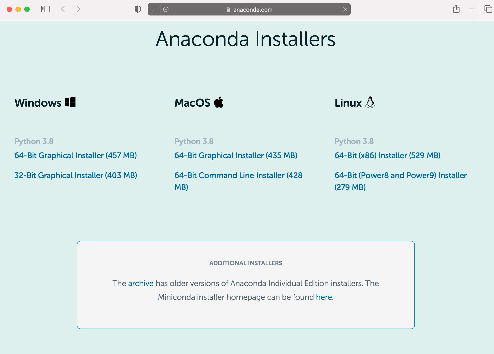
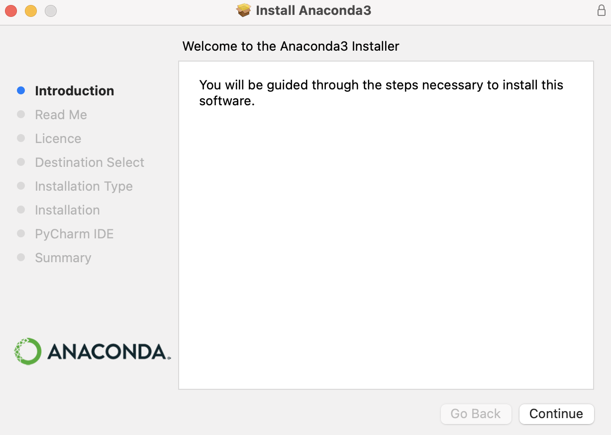

# Setting Up a Python Environment
To learn Python we're going to use a browser based tool called the *Jupyter Notebook*. Jupyter allows you to type Python code and see the output all in the same place. It also has lots of in-built functions to make it easier for you to learn and use Python. In other words, it's the ideal tool for learning Python.

We'll be downloading Jupyter, as well as a number of other useful data science tools and libraries, from a website called [Anaconda](https://www.anaconda.com) which provides an environment (also called Anaconda) for accessing various data science tools. These are the steps to go through to get up and running with Anaconda and the Jupyter Notebook.

## Step 1: Download Anaconda

To download Anaconda for your operating system visit https://www.anaconda.com/products/individual and select the `Download` button. You'll see these choices.

Choose your operating system. If you use Windows or MacOS I suggest you use the `64-Bit Graphical Installer`. This will download the installation file which you must open. On a Mac it looks like this when you open the downloaded file.

Once the download has completed open the dowloaded file and follow the instructions to install it.  

You can accept all of the defaults after agreeing the license terms. 

Once you have installed Anaconda you need to run the Anaconda Navigator from wherever it was installed. You should then see a screen like this.

From here you can launch the Jupyter Notebook by clicking on the `Launch` button for that application. The Jupyter Notebook will open in a new browser window.

You're now ready to start the first part of this module, [Python Crash Course - Part I](PART-I.md).